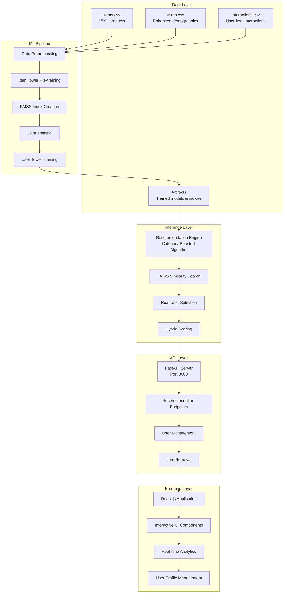
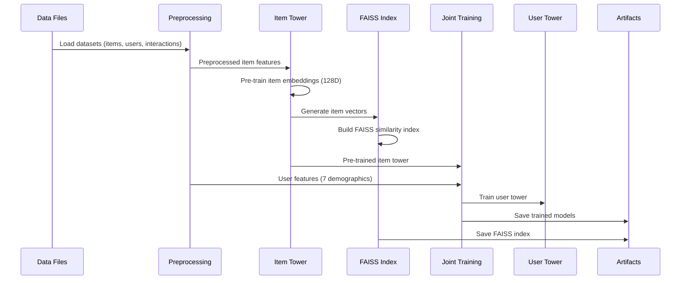
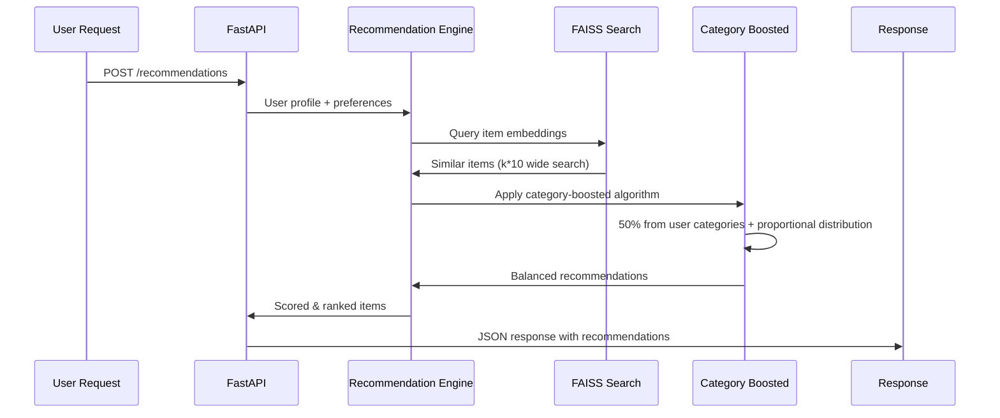
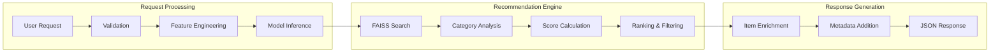

# Deep Architecture Documentation - RecSys-HP

## 🏗️ Complete System Architecture Overview



---

## 📁 Project Structure

```
RecSys-HP/
├── 🗂️ Data Layer
│   ├── datasets/
│   │   ├── items.csv                    # 15K+ product catalog
│   │   ├── users.csv                    # Enhanced user demographics (7 features)
│   │   ├── interactions.csv             # User-item interaction history
│   │   └── users_enhanced.csv           # Backup with enhanced features
│   └── src/artifacts/                   # Trained models and indices
│       ├── item_embeddings.npy          # Pre-trained item vectors (128D)
│       ├── faiss_item_index.bin         # FAISS similarity index
│       ├── faiss_metadata.pkl           # Item metadata mapping
│       ├── vocabularies.pkl             # Categorical encoders
│       └── *.weights.* files            # TensorFlow model weights
│
├── 🧠 ML Pipeline
│   ├── src/preprocessing/
│   │   ├── data_loader.py               # Data loading and preprocessing
│   │   └── user_data_preparation.py     # User feature engineering
│   ├── src/training/
│   │   ├── item_pretraining.py          # Item tower pre-training
│   │   └── joint_training.py            # Two-tower joint training
│   ├── src/models/
│   │   ├── item_tower.py                # Item embedding model (TensorFlow)
│   │   └── user_tower.py                # User embedding model (TensorFlow)
│   └── Training Scripts
│       ├── run_training_pipeline.py     # Complete pipeline executor
│       ├── run_2phase_training.py       # 2-phase training approach
│       └── run_joint_training.py        # Joint training approach
│
├── 🔍 Inference Layer
│   ├── src/inference/
│   │   ├── recommendation_engine.py     # Core recommendation algorithms
│   │   └── faiss_index.py               # FAISS index management
│   ├── src/utils/
│   │   └── real_user_selector.py        # Real user data selection
│   └── src/data_generation/
│       └── generate_demographics.py     # Synthetic user generation
│
├── 🌐 API Layer
│   └── api/
│       └── main.py                      # FastAPI server with all endpoints
│
├── 🎨 Frontend Layer
│   └── frontend/
│       ├── src/
│       │   ├── App.js                   # Main React application
│       │   └── index.js                 # Entry point
│       ├── public/                      # Static assets
│       ├── build/                       # Production build
│       └── package.json                 # Dependencies
│
└── 🧪 Testing & Analysis
    ├── test_category_boosted.py         # Basic algorithm testing
    ├── test_enhanced_category_boosted.py # Advanced subcategory testing
    └── deep_analyze_category_boosted.py # Comprehensive analysis tool
```

---

## 🔄 Data Flow Architecture

### 1. Training Pipeline Flow


### 2. Inference Pipeline Flow


---

## 🧠 Machine Learning Architecture

### Two-Tower Architecture
```
┌─────────────────────────┐    ┌─────────────────────────┐
│      ITEM TOWER         │    │      USER TOWER         │
│                         │    │                         │
│ ┌─────────────────────┐ │    │ ┌─────────────────────┐ │
│ │   Item Features     │ │    │ │ Demographic Features│ │
│ │                     │ │    │ │                     │ │
│ │ • product_id        │ │    │ │ • age (normalized)  │ │
│ │ • category_code     │ │    │ │ • gender (encoded)  │ │
│ │ • brand             │ │    │ │ • income (binned)   │ │
│ │ • price (log)       │ │    │ │ • profession        │ │
│ │                     │ │    │ │ • location          │ │
│ └─────────────────────┘ │    │ │ • education_level   │ │
│           │             │    │ │ • marital_status    │ │
│           ▼             │    │ └─────────────────────┘ │
│ ┌─────────────────────┐ │    │           │             │
│ │   Dense Layers      │ │    │           ▼             │
│ │                     │ │    │ ┌─────────────────────┐ │
│ │ • Dense(256, ReLU)  │ │    │ │   Dense Layers      │ │
│ │ • Dropout(0.3)      │ │    │ │                     │ │
│ │ • Dense(128, ReLU)  │ │    │ │ • Dense(128, ReLU)  │ │
│ │ • L2 Regularization │ │    │ │ • Dropout(0.2)      │ │
│ │                     │ │    │ │ • Dense(64, ReLU)   │ │
│ └─────────────────────┘ │    │ │ • L2 Regularization │ │
│           │             │    │ └─────────────────────┘ │
│           ▼             │    │           │             │
│ ┌─────────────────────┐ │    │           ▼             │
│ │  Item Embedding     │ │    │ ┌─────────────────────┐ │
│ │     (128D)          │ │    │ │  User Embedding     │ │
│ │                     │ │    │ │     (64D)           │ │
│ └─────────────────────┘ │    │ └─────────────────────┘ │
└─────────────────────────┘    └─────────────────────────┘
           │                              │
           └──────────────┬───────────────┘
                          ▼
            ┌─────────────────────────┐
            │    Dot Product          │
            │   Similarity Score      │
            │                         │
            │ similarity = user_emb   │
            │            · item_emb   │
            └─────────────────────────┘
```

### Category-Boosted Algorithm
```
┌─────────────────────────────────────────────────────────────────────────┐
│                    CATEGORY-BOOSTED RECOMMENDATION FLOW                  │
├─────────────────────────────────────────────────────────────────────────┤
│                                                                         │
│ 1. USER INTERACTION ANALYSIS                                            │
│    ┌─────────────────────────────────────┐                             │
│    │ interaction_history: [1001, 2003,   │                             │
│    │                      3045, 1099]    │                             │
│    └─────────────────────────────────────┘                             │
│                        │                                                │
│                        ▼                                                │
│    ┌─────────────────────────────────────┐                             │
│    │ Extract 2-level subcategories:      │                             │
│    │ • computers.components: 40%         │                             │
│    │ • electronics.audio: 35%            │                             │
│    │ • computers.peripherals: 25%        │                             │
│    └─────────────────────────────────────┘                             │
│                                                                         │
│ 2. WIDE SIMILARITY SEARCH                                               │
│    ┌─────────────────────────────────────┐                             │
│    │ FAISS.search(user_embedding,        │                             │
│    │              k = requested * 10)    │                             │
│    │                                     │                             │
│    │ Returns: ~1000 similar items        │                             │
│    └─────────────────────────────────────┘                             │
│                        │                                                │
│                        ▼                                                │
│ 3. CATEGORY ORGANIZATION                                                │
│    ┌─────────────────────────────────────┐                             │
│    │ Group by subcategories:             │                             │
│    │                                     │                             │
│    │ computers.components: [1001, 1099,  │                             │
│    │                       1203, ...]    │                             │
│    │ electronics.audio: [2003, 2156,     │                             │
│    │                    2089, ...]       │                             │
│    │ computers.peripherals: [3045, 3201, │                             │
│    │                        3078, ...]   │                             │
│    │ other_categories: [4001, 5002, ...] │                             │
│    └─────────────────────────────────────┘                             │
│                        │                                                │
│                        ▼                                                │
│ 4. PROPORTIONAL ALLOCATION                                              │
│    ┌─────────────────────────────────────┐                             │
│    │ Target: 50% from user categories    │                             │
│    │ (50 items for 100 recommendations)  │                             │
│    │                                     │                             │
│    │ computers.components: 40% → 20 items│                             │
│    │ electronics.audio: 35% → 18 items   │                             │
│    │ computers.peripherals: 25% → 12 items│                            │
│    │                                     │                             │
│    │ Remaining 50 items: diverse mix     │                             │
│    └─────────────────────────────────────┘                             │
│                        │                                                │
│                        ▼                                                │
│ 5. FINAL RECOMMENDATION SET                                             │
│    ┌─────────────────────────────────────┐                             │
│    │ • 50 items from user's categories   │                             │
│    │   (proportionally distributed)      │                             │
│    │ • 50 items for exploration          │                             │
│    │ • All ranked by similarity score    │                             │
│    │ • Ensures category diversity        │                             │
│    └─────────────────────────────────────┘                             │
└─────────────────────────────────────────────────────────────────────────┘
```

---

## 🌐 API Architecture

### FastAPI Server Endpoints
```python
# Core Recommendation Endpoints
POST   /recommendations              # Main recommendation engine
GET    /real-users                   # Fetch real user profiles
GET    /items/{item_id}              # Get item details
GET    /dataset-summary              # Dataset statistics

# Algorithm-Specific Endpoints
POST   /recommendations/hybrid       # Hybrid collaborative + content
POST   /recommendations/collaborative # Pure collaborative filtering
POST   /recommendations/content      # Aggregated history content-based recommendations
POST   /recommendations/category_boosted # Category-boosted algorithm

# Utility Endpoints
GET    /                            # Health check
GET    /sample-items                # Random item samples
POST   /generate-interactions       # Synthetic interaction generation
```

### Request/Response Flow


---

## 🎨 Frontend Architecture

### React.js Component Structure
```
App.js (Main Container)
├── User Profile Management
│   ├── Demographics Form
│   ├── Real User Selection
│   └── Interaction History Display
├── Recommendation Controls
│   ├── Algorithm Selection
│   ├── Count Configuration
│   └── Weight Adjustment
├── Results Display
│   ├── Recommendation Cards
│   ├── Category Analytics
│   ├── Pagination Controls
│   └── Similar Items View
└── Analysis Components
    ├── Category Interest Graphs
    ├── Interaction Patterns
    └── Performance Metrics
```

### State Management
```javascript
const [userProfile, setUserProfile] = useState({
    age: 30,
    gender: 'male',
    income: 50000,
    profession: 'Technology',
    location: 'Urban',
    education_level: "Bachelor's",
    marital_status: 'Single',
    interaction_history: []
});

const [recommendationType, setRecommendationType] = useState('category_boosted');
const [recommendations, setRecommendations] = useState([]);
const [realUsers, setRealUsers] = useState([]);
const [datasetSummary, setDatasetSummary] = useState(null);
```

---

## 🔍 Algorithm Deep Dive

### 1. Hybrid Recommendation
- **Collaborative Filtering**: User-item interaction patterns
- **Aggregated Content-Based**: User's complete interaction history aggregated into single embedding
- **Weight Balance**: Configurable collaborative weight (default: 0.7)

### 1.5. Aggregated History Content-Based Filtering
- **Revolutionary Approach**: Aggregates user's entire interaction history instead of single-item similarity
- **Aggregation Methods**:
  - **Weighted Mean**: `weights = exp(linspace(-1, 0, len(history)))` (recent interactions weighted higher)
  - **Simple Mean**: Equal weighting of all interaction embeddings
  - **Max Pooling**: Element-wise maximum across all embeddings
- **Process Flow**:
  1. **Embedding Extraction**: Get 128D vectors for each item in user's history
  2. **Aggregation**: Apply selected aggregation method (weighted_mean by default)
  3. **Normalization**: L2-normalize the aggregated embedding
  4. **ANN Search**: Direct FAISS similarity search using aggregated user profile
  5. **Filtering**: Remove already-interacted items from results
- **Benefits**: Captures complete user preference profile, more robust than single-item seed

### 2. Category-Boosted Algorithm
- **Step 1**: Analyze user's subcategory preferences (2-level depth)
- **Step 2**: Wide FAISS search (k × 10 multiplier)
- **Step 3**: Category organization and candidate grouping
- **Step 4**: Proportional allocation (50% from user categories)
- **Step 5**: Exploration items filling (remaining 50%)

### 3. FAISS Integration
- **Index Type**: Flat L2 similarity search
- **Vector Dimension**: 128D item embeddings
- **Search Strategy**: Wide retrieval + post-processing
- **Metadata**: Item-to-index mapping via pickle files

---

## 📊 Performance Characteristics

### Scalability Metrics
- **Items**: 15K+ products supported
- **Users**: Unlimited (stateless design)
- **Recommendations**: 1-1000 per request
- **Response Time**: <2s for 100 recommendations
- **Memory Usage**: ~500MB for full model + index

### Algorithm Performance
- **Category Matching**: ≥50% from user's categories
- **Diversity Score**: Balanced exploration vs exploitation
- **Cold Start**: Handles new users via demographic features
- **Subcategory Precision**: 2-level category matching

---

## 🚀 Deployment Architecture

### Development Environment
```bash
# Backend (FastAPI)
cd /api && python main.py

# Frontend (React)
cd frontend && npm start

# Training Pipeline
python run_training_pipeline.py
```

### Production Considerations
- **Containerization**: Docker support for API + Frontend
- **Database**: PostgreSQL for production user/item storage
- **Caching**: Redis for recommendation caching
- **Load Balancing**: Nginx for multiple API instances
- **Monitoring**: Prometheus + Grafana for metrics

---

## 🔧 Configuration & Customization

### Model Configuration
```python
# Item Tower
ITEM_EMBEDDING_DIM = 128
ITEM_HIDDEN_LAYERS = [256, 128]
ITEM_DROPOUT_RATE = 0.3

# User Tower  
USER_EMBEDDING_DIM = 64
USER_HIDDEN_LAYERS = [128, 64]
USER_DROPOUT_RATE = 0.2

# Training
BATCH_SIZE = 512
LEARNING_RATE = 0.001
EPOCHS = 100
VALIDATION_SPLIT = 0.2
```

### Algorithm Parameters
```python
# Category-Boosted
WIDE_SEARCH_MULTIPLIER = 10
USER_CATEGORY_PERCENTAGE = 0.5
SUBCATEGORY_LEVELS = 2
MIN_INTERACTION_THRESHOLD = 5

# FAISS
INDEX_TYPE = "Flat"
SIMILARITY_METRIC = "L2"
SEARCH_PARAMS = {"nprobe": 10}

# Aggregated Content-Based
AGGREGATION_METHOD = "weighted_mean"  # "mean", "weighted_mean", "max"
TEMPORAL_DECAY_ALPHA = 1.0  # Controls recency weighting strength
HISTORY_LIMIT = 50  # Max items to consider for aggregation
```

---

## 🧪 Testing Framework

### Test Coverage
- **Unit Tests**: Individual algorithm components
- **Integration Tests**: End-to-end recommendation flow
- **Performance Tests**: Latency and throughput benchmarks
- **Accuracy Tests**: Category matching validation

### Analysis Tools
- `test_category_boosted.py`: Basic algorithm validation
- `test_enhanced_category_boosted.py`: Advanced subcategory testing  
- `deep_analyze_category_boosted.py`: Comprehensive performance analysis
- **`analyze_recommendation_alignment.py`**: **NEW** - Multi-algorithm alignment analysis
  - Tests all 4 algorithms (collaborative, content, hybrid, category_boosted)
  - Category alignment scoring and coverage analysis
  - Diversity vs relevance trade-off analysis
  - User-specific algorithm performance comparison
  - Generates comprehensive visualizations and reports

### Algorithm Comparison Metrics
- **Top-Level Alignment**: % of recommendations matching user's preferred categories
- **Subcategory Precision**: 2-level category matching accuracy
- **Coverage Score**: % of user's categories represented in recommendations
- **Diversity Score**: Shannon entropy of recommendation categories
- **Performance by Scale**: Algorithm behavior across 10-100+ recommendations

---

## 📈 Future Enhancements

### Planned Features
1. **Real-time Learning**: Online model updates
2. **A/B Testing**: Algorithm comparison framework
3. **Explainability**: Recommendation reasoning
4. **Multi-objective**: Balancing relevance, diversity, novelty
5. **Graph Neural Networks**: Advanced relationship modeling

### Technical Debt
- [ ] Add comprehensive error handling
- [ ] Implement request caching
- [ ] Add model versioning
- [ ] Create automated testing pipeline
- [ ] Add performance monitoring

---

This deep architecture documentation provides a comprehensive view of the RecSys-HP recommendation system, covering all layers from data storage to user interface, with detailed technical specifications and implementation details.